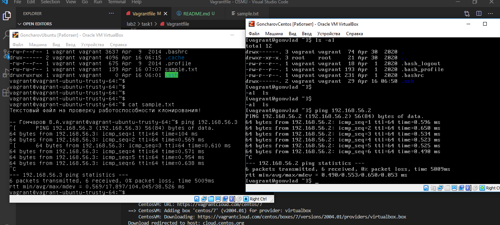

# Лабораторная работа №2

## Настройка виртуализации двух машин Ubuntu и Centos средствами Vagrant
***Задание:***
### 1. В своем репозитории создайте ветку и загрузите в нее файл sample.txt с произвольным текстом;
### 2.	Установить себе на машину Vagrant и VirtualBox;
### 3.	Создать Vagrantfile, описывающий развертывание 2 ВМ (Ubuntu or Centos boxes); 
### 4.	Настроить сеть и сетевые имена машин в соответствии UNIX стандарта; 
### 5.	С помощью “Shell” provisioner:
###     • установить СКВ git и настроить подключение к вашему удаленному репозиторию на GitHub;
###     • склонировать ветку Module 2 и выведите в консоль содержимое sample.txt;
### 6.	Проверьте доступность машин командой ping (пинг между машинами должен работать через DNS-имена);
### 7.	Результат вручную залейте в ветку своего GitHub-репозитория.

### Отчеты:
1.  Проверка работоспособности машины UbuntuVM:
    

2.  Проверка работоспособности машины CentosVM:
    

3.  Содержимое файла "sample.txt":
    

3.  Проверка устанволенного ping соединение между машинами:
    

